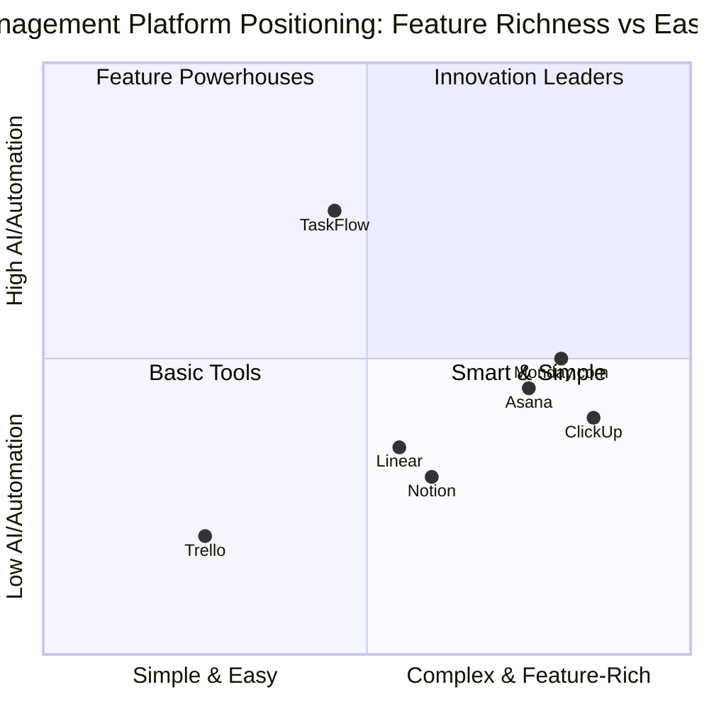
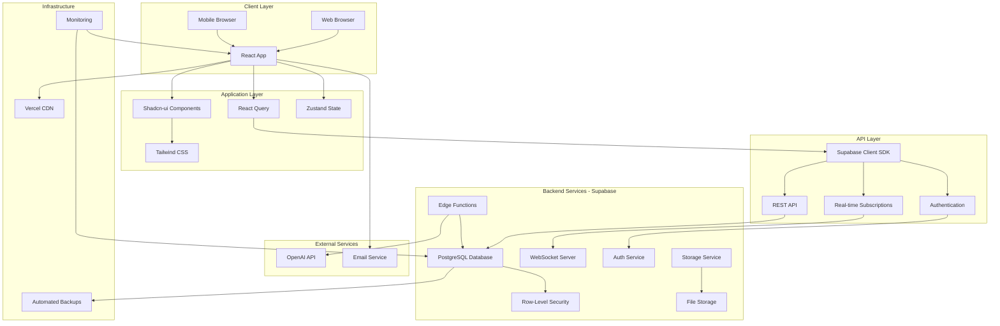

# TaskFlow - Product Requirements Document (PRD)

**Version:** 1.0  
**Date:** November 2, 2025  
**Product Manager:** Emma  
**Project Name:** task_flow  
**Programming Language:** Shadcn-ui, TypeScript, Tailwind CSS, React  
**Backend:** Supabase (Authentication, Database, Real-time, Storage)

---

## Executive Summary

TaskFlow is a modern, AI-powered task management SaaS platform designed specifically for remote teams. It combines the simplicity of traditional task managers with intelligent prioritization capabilities to help distributed teams work more efficiently. By leveraging AI to suggest optimal task priorities and providing real-time collaboration features, TaskFlow addresses the unique challenges faced by remote teams in managing workload and maintaining productivity across different time zones.

**Original Requirements Restatement:**
Build a comprehensive task management platform for remote teams featuring AI-powered task prioritization, real-time collaboration, time tracking, project organization, role-based access control, analytics dashboards, and a freemium business model. The platform must support Supabase as the backend for authentication, database, real-time updates, and storage capabilities.

---

## 1. Product Definition

### 1.1 Product Goals

1. **Empower Remote Teams with Intelligent Task Management**: Provide an intuitive platform that uses AI to automatically suggest task priorities based on deadlines, dependencies, workload distribution, and historical patterns, reducing decision fatigue and improving team productivity by 30%.

2. **Enable Seamless Real-Time Collaboration**: Create a unified workspace where distributed team members can collaborate asynchronously and synchronously through real-time updates, comments, @mentions, and presence indicators, reducing communication overhead by 40%.

3. **Deliver Actionable Insights Through Analytics**: Offer comprehensive dashboards and reports that provide visibility into team performance, task completion rates, time tracking data, and productivity trends, enabling data-driven decision-making and continuous improvement.

### 1.2 User Stories

1. **As a project manager**, I want AI to suggest task priorities based on deadlines and team workload, so that I can optimize resource allocation and ensure critical tasks are completed on time.

2. **As a remote team member**, I want to receive real-time notifications when I'm mentioned in task comments, so that I can stay informed and respond quickly to team discussions without constantly checking the platform.

3. **As a freelancer**, I want to track time spent on each task with start/stop timers, so that I can accurately bill clients and understand where my time is being invested.

4. **As a team lead**, I want to view team productivity analytics and task completion trends, so that I can identify bottlenecks, recognize high performers, and make informed decisions about project timelines.

5. **As a startup founder**, I want to organize tasks into multiple projects with different views (Kanban, List, Calendar), so that I can manage various initiatives simultaneously and visualize progress in the format that works best for each project.

### 1.3 Competitive Analysis

| Product | Strengths | Weaknesses | Price Point | Target Market |
|---------|-----------|------------|-------------|---------------|
| **Trello** | • Simple, intuitive Kanban interface<br>• Easy onboarding<br>• Strong visual organization<br>• Extensive Power-Ups ecosystem | • Lacks AI capabilities<br>• Limited advanced features<br>• No built-in time tracking<br>• Weak analytics | Free tier available<br>$5-17.50/user/month | Small teams, visual thinkers, simple projects |
| **Asana** | • Comprehensive feature set<br>• Multiple project views<br>• Strong automation<br>• Timeline/Gantt charts | • Steep learning curve<br>• Overwhelming UI for new users<br>• No native AI prioritization<br>• Expensive at scale | Free tier limited<br>$10.99-24.99/user/month | Mid to large enterprises, complex projects |
| **Monday.com** | • Highly customizable<br>• Beautiful UI<br>• Strong automation<br>• Good integrations | • Very expensive<br>• Feature bloat<br>• Overwhelming for small teams<br>• Complex pricing structure | Starts at $8/user/month<br>Can exceed $16/user/month | Mid-market to enterprise |
| **ClickUp** | • Feature-rich<br>• All-in-one platform<br>• Competitive pricing<br>• Multiple views | • Performance issues<br>• UI cluttered<br>• Feature overload<br>• Inconsistent UX | Free tier available<br>$7-19/user/month | Teams wanting all-in-one solution |
| **Notion** | • Flexible workspace<br>• Great for documentation<br>• Database capabilities<br>• Affordable | • Not purpose-built for task management<br>• Lacks AI prioritization<br>• Limited project management features | Free tier available<br>$8-15/user/month | Knowledge workers, documentation-heavy teams |
| **Linear** | • Fast, modern interface<br>• Built for software teams<br>• Keyboard shortcuts<br>• Clean design | • Limited to software development<br>• No AI prioritization<br>• Narrow use case<br>• Less suitable for non-tech teams | $8-16/user/month | Software development teams |
| **TaskFlow** | • **AI-powered prioritization**<br>• Built for remote teams<br>• Real-time collaboration<br>• Simple yet powerful<br>• Transparent pricing<br>• Modern tech stack | • New entrant (less brand recognition)<br>• Smaller integration ecosystem initially<br>• Building user base | Free tier: 5 users<br>Pro: $10/user/month<br>Enterprise: Custom | Remote teams, SMBs, startups, digital agencies |

### 1.4 Competitive Quadrant Chart



**Positioning Analysis:**
- **TaskFlow occupies the "Innovation Leaders" quadrant**, combining high AI/automation capabilities with ease of use
- **Key Differentiator**: AI-powered task prioritization sets TaskFlow apart from all competitors
- **Strategic Advantage**: Simpler than Asana/Monday.com but more intelligent than Trello
- **Target Gap**: Serves teams wanting smart automation without complexity

---

## 2. Market Analysis

### 2.1 Market Size & Opportunity

The global task management software market is experiencing robust growth, driven by the widespread adoption of remote work and the increasing need for digital collaboration tools:

- **Current Market Size (2024)**: $4.33 billion USD
- **Projected Market Size (2030)**: $9.67 billion USD
- **CAGR (2024-2030)**: 14.3%
- **Total Addressable Market (TAM)**: 500+ million knowledge workers globally
- **Serviceable Addressable Market (SAM)**: 50 million remote team members in SMBs
- **Serviceable Obtainable Market (SOM)**: 500,000 users in first 3 years (1% of SAM)

**Key Market Drivers:**
1. **Remote Work Transformation**: 16% of companies globally are now fully remote, with 62% of workers aged 22-65 working remotely at least occasionally
2. **Productivity Demands**: Teams report 40% productivity loss due to poor task prioritization and unclear priorities
3. **AI Adoption**: 77% of companies are using or exploring AI tools to improve business processes
4. **Collaboration Needs**: Distributed teams require real-time collaboration tools that work across time zones

### 2.2 Target Market Segments

**Primary Target Segments:**

1. **Small to Medium Remote Teams (5-50 people)** - 45% of target market
   - Digital agencies, consulting firms, remote-first startups
   - Pain points: Coordinating across time zones, unclear priorities, scattered tools
   - Willingness to pay: $8-15/user/month

2. **Freelancers and Solopreneurs** - 25% of target market
   - Independent consultants, designers, developers managing multiple clients
   - Pain points: Time tracking, client communication, project organization
   - Willingness to pay: $5-10/month (flat rate preferred)

3. **Startups and Tech Companies** - 20% of target market
   - Early-stage companies (seed to Series B) with distributed teams
   - Pain points: Rapid scaling, changing priorities, limited resources
   - Willingness to pay: $10-20/user/month

4. **Digital Agencies** - 10% of target market
   - Marketing, design, and development agencies managing client projects
   - Pain points: Multiple projects, client visibility, resource allocation
   - Willingness to pay: $12-25/user/month

**Secondary Target Segments:**
- Educational institutions and student groups
- Non-profit organizations
- Enterprise teams (future expansion)

### 2.3 Market Trends

1. **AI Integration in Productivity Tools**: 65% of knowledge workers expect AI assistance in their daily tools by 2025
2. **Shift to Asynchronous Collaboration**: Remote teams increasingly prefer async communication over synchronous meetings
3. **All-in-One Platform Fatigue**: Users are moving away from bloated platforms toward focused, best-in-class tools
4. **Mobile-First Expectations**: 70% of task management happens on mobile devices
5. **Data Privacy & Security**: SOC 2 compliance becoming table stakes for B2B SaaS

---

## 3. User Personas

### Persona 1: Sarah Chen - Remote Project Manager

**Demographics:**
- Age: 32
- Location: San Francisco, CA (team distributed globally)
- Role: Project Manager at a 25-person digital agency
- Experience: 7 years in project management
- Tech Savviness: High

**Goals:**
- Ensure all client projects are delivered on time and within budget
- Optimize team resource allocation across multiple projects
- Reduce time spent on administrative task management
- Improve visibility into team workload and capacity

**Pain Points:**
- Spends 2+ hours daily manually prioritizing tasks and updating project status
- Struggles to balance workload across team members in different time zones
- Lacks clear visibility into which tasks are at risk of missing deadlines
- Current tool (Asana) is too complex for team members to adopt fully

**Behaviors:**
- Checks task management tool 15-20 times per day
- Prefers Kanban view for active projects, List view for planning
- Relies heavily on notifications and @mentions
- Uses mobile app during commute and between meetings

**TaskFlow Value Proposition:**
- AI prioritization saves 10+ hours per week on task organization
- Real-time updates keep her informed without constant checking
- Simple interface increases team adoption and reduces training time
- Analytics dashboard provides instant visibility into project health

**Quote:** *"I need a tool that helps me make smart decisions about priorities, not just organize tasks. My team is spread across 5 time zones—I can't micromanage everyone."*

---

### Persona 2: Marcus Rodriguez - Freelance Developer

**Demographics:**
- Age: 28
- Location: Austin, TX (works with clients globally)
- Role: Full-stack developer and technical consultant
- Experience: 5 years freelancing
- Tech Savviness: Very High

**Goals:**
- Accurately track billable hours for multiple clients
- Manage personal task pipeline and deadlines
- Maintain work-life balance and avoid overcommitment
- Demonstrate value to clients through transparent progress tracking

**Pain Points:**
- Juggling 3-5 client projects simultaneously with competing priorities
- Forgetting to track time, leading to lost billable hours
- Difficulty estimating how long tasks will take
- No clear system for prioritizing which client work to tackle first

**Behaviors:**
- Works in focused 2-4 hour blocks
- Prefers keyboard shortcuts and quick actions
- Reviews tasks first thing in morning and before bed
- Needs mobile access for quick updates between client meetings

**TaskFlow Value Proposition:**
- AI suggests which client tasks to prioritize based on deadlines and estimated effort
- Integrated time tracking ensures no billable hours are lost
- Simple interface doesn't require constant maintenance
- Free tier allows testing before committing to paid plan

**Quote:** *"I'm a developer, not a project manager. I just want something that tells me what to work on next and tracks my time automatically."*

---

### Persona 3: Jennifer Park - Startup Founder & CEO

**Demographics:**
- Age: 35
- Location: New York, NY (team remote-first, 15 people)
- Role: Co-founder and CEO of B2B SaaS startup
- Experience: 10 years in tech, 2nd time founder
- Tech Savviness: High

**Goals:**
- Scale company from 15 to 50 people over next 18 months
- Maintain team productivity and culture in remote environment
- Make data-driven decisions about resource allocation
- Keep burn rate low while maximizing team output

**Pain Points:**
- Current tool (Monday.com) costs $3,000/month and climbing with team growth
- Team complains about tool complexity and feature overload
- Lacks insights into which team members are overloaded vs underutilized
- Needs better visibility into cross-functional project dependencies

**Behaviors:**
- Reviews team dashboard weekly during leadership meetings
- Relies on reports and analytics rather than individual task details
- Needs to onboard new hires quickly with minimal training
- Values tools that integrate with existing stack (Slack, GitHub, etc.)

**TaskFlow Value Proposition:**
- Transparent pricing scales predictably with team growth ($10/user vs $15-20/user)
- Simple interface reduces onboarding time from days to hours
- Team analytics provide clear visibility into productivity and capacity
- AI prioritization helps team self-organize, reducing management overhead

**Quote:** *"We're burning cash to grow fast. I need tools that scale with us without breaking the bank or slowing us down with complexity."*

---

## 4. Technical Requirements

### 4.1 Requirements Analysis

TaskFlow must deliver a high-performance, secure, and scalable task management platform that serves remote teams globally. The system architecture leverages Supabase for backend services, providing real-time capabilities, robust authentication, and PostgreSQL database with row-level security. The frontend utilizes modern React with Shadcn-ui components and Tailwind CSS for a responsive, accessible user interface.

**Core Technical Challenges:**
1. **Real-time Synchronization**: Ensuring task updates, comments, and notifications propagate instantly across all connected clients without conflicts
2. **AI Integration**: Implementing intelligent task prioritization that processes multiple factors (deadlines, dependencies, workload) efficiently
3. **Performance at Scale**: Maintaining sub-2-second page loads even with thousands of tasks and complex queries
4. **Data Security**: Implementing row-level security policies to ensure users only access authorized data
5. **Offline Capability**: Providing graceful degradation when network connectivity is limited

**Technology Stack Rationale:**

- **Frontend Framework (React + TypeScript)**: Type safety reduces bugs, large ecosystem, excellent developer experience
- **UI Components (Shadcn-ui)**: Accessible, customizable components that maintain design consistency
- **Styling (Tailwind CSS)**: Rapid development, small bundle size, responsive design utilities
- **Backend (Supabase)**: 
  - PostgreSQL for relational data with ACID compliance
  - Built-in authentication with JWT tokens
  - Real-time subscriptions via WebSockets
  - Row-level security for multi-tenant architecture
  - Storage for file attachments
  - Edge functions for serverless compute
- **AI/ML**: Integration with OpenAI API or similar for task prioritization logic
- **State Management**: React Query for server state, Zustand for client state
- **Deployment**: Vercel for frontend (edge network), Supabase cloud for backend

### 4.2 Requirements Pool

#### Priority P0 (Must-Have for MVP)

| ID | Requirement | Description | Acceptance Criteria |
|----|-------------|-------------|---------------------|
| P0-1 | User Authentication | Users MUST be able to register, login, and logout securely using email/password | • Registration creates user account<br>• Login generates valid JWT token<br>• Logout invalidates session<br>• Password reset flow functional |
| P0-2 | Task CRUD Operations | Users MUST be able to create, read, update, and delete tasks | • Create task with title, description<br>• View task details<br>• Edit task properties<br>• Delete task with confirmation |
| P0-3 | Task Assignment | Users MUST be able to assign tasks to team members | • Select assignee from team list<br>• Assignee receives notification<br>• Unassigned tasks visible in backlog |
| P0-4 | Task Status Management | Users MUST be able to update task status (To Do, In Progress, Done) | • Status changes reflected immediately<br>• Status visible in all views<br>• Status history tracked |
| P0-5 | Project Organization | Users MUST be able to organize tasks into projects | • Create/edit/delete projects<br>• Assign tasks to projects<br>• Filter tasks by project |
| P0-6 | Kanban Board View | Users MUST be able to view and manage tasks in Kanban format | • Columns for each status<br>• Drag-and-drop to change status<br>• Visual card representation |
| P0-7 | Real-time Updates | Changes MUST propagate to all connected clients within 1 second | • Task updates visible to all users<br>• No manual refresh required<br>• Conflict resolution for simultaneous edits |
| P0-8 | Team Management | Users MUST be able to invite team members and manage team roster | • Send email invitations<br>• Accept/decline invitations<br>• View team member list<br>• Remove team members (admin only) |
| P0-9 | Basic Search | Users MUST be able to search tasks by title and description | • Search box returns relevant results<br>• Results update as user types<br>• Search across all accessible tasks |
| P0-10 | Responsive Design | Application MUST work on desktop, tablet, and mobile devices | • Layout adapts to screen size<br>• Touch-friendly on mobile<br>• No horizontal scrolling<br>• Readable text at all sizes |

#### Priority P1 (Should-Have for Launch)

| ID | Requirement | Description | Acceptance Criteria |
|----|-------------|-------------|---------------------|
| P1-1 | AI Task Prioritization | System SHOULD suggest task priorities using AI based on multiple factors | • AI analyzes deadlines, dependencies, workload<br>• Suggestions displayed with reasoning<br>• Users can accept/reject suggestions<br>• Accuracy improves over time |
| P1-2 | Task Comments | Users SHOULD be able to comment on tasks and @mention team members | • Add comments to tasks<br>• @mention triggers notification<br>• Comment history visible<br>• Edit/delete own comments |
| P1-3 | Time Tracking | Users SHOULD be able to track time spent on tasks | • Start/stop timer for active task<br>• Manual time entry option<br>• Time logs visible on task<br>• Total time calculated |
| P1-4 | Notifications System | Users SHOULD receive in-app and email notifications for relevant events | • Notification for assignments<br>• Notification for @mentions<br>• Notification for due dates<br>• Configurable preferences |
| P1-5 | List View | Users SHOULD be able to view tasks in list format with sorting/filtering | • Sortable columns<br>• Filter by multiple criteria<br>• Bulk select for actions<br>• Export to CSV |
| P1-6 | Calendar View | Users SHOULD be able to view tasks on a calendar by due date | • Monthly/weekly/daily views<br>• Drag to reschedule<br>• Color-coded by project<br>• Today indicator |
| P1-7 | Task Dependencies | Users SHOULD be able to define task dependencies | • Link dependent tasks<br>• Visual dependency indicators<br>• Warnings for circular dependencies<br>• Dependency chain view |
| P1-8 | Advanced Filters | Users SHOULD be able to create and save complex filter combinations | • Filter by assignee, status, priority, date, tags<br>• Combine multiple filters<br>• Save filter presets<br>• Share filters with team |
| P1-9 | Dashboard Analytics | Users SHOULD see personal and team productivity dashboards | • Task completion metrics<br>• Time tracking summaries<br>• Productivity trends<br>• Customizable widgets |
| P1-10 | Role-Based Access Control | System SHOULD enforce different permission levels (Admin, Manager, Member) | • Admins: full access<br>• Managers: project-level control<br>• Members: assigned tasks only<br>• Permission checks enforced |

#### Priority P2 (Nice-to-Have for Future)

| ID | Requirement | Description | Acceptance Criteria |
|----|-------------|-------------|---------------------|
| P2-1 | File Attachments | Users MAY attach files to tasks | • Upload files up to 10MB<br>• Preview common formats<br>• Download attachments<br>• Delete attachments |
| P2-2 | Task Templates | Users MAY create and use task templates for recurring work | • Create template from task<br>• Apply template to new task<br>• Template library<br>• Share templates |
| P2-3 | Gantt Chart View | Users MAY view project timeline in Gantt chart format | • Timeline visualization<br>• Dependency lines<br>• Drag to adjust dates<br>• Critical path highlighting |
| P2-4 | Custom Fields | Users MAY add custom fields to tasks | • Define field types<br>• Add to task forms<br>• Filter/sort by custom fields<br>• Project-specific fields |
| P2-5 | Integrations | System MAY integrate with external tools (Slack, GitHub, Google Calendar) | • OAuth connection flow<br>• Sync data bidirectionally<br>• Webhook support<br>• Integration marketplace |
| P2-6 | Automation Rules | Users MAY create automation rules for repetitive actions | • Trigger-action rules<br>• Conditional logic<br>• Rule templates<br>• Execution logs |
| P2-7 | Mobile Apps | Native iOS and Android apps MAY be developed | • Feature parity with web<br>• Push notifications<br>• Offline mode<br>• App store distribution |
| P2-8 | White-Label Option | Enterprise customers MAY customize branding | • Custom logo and colors<br>• Custom domain<br>• Branded emails<br>• Remove TaskFlow branding |
| P2-9 | API Access | Developers MAY access TaskFlow data via REST API | • Comprehensive API documentation<br>• Authentication via API keys<br>• Rate limiting<br>• Webhook support |
| P2-10 | Advanced Reporting | Users MAY generate custom reports and export data | • Report builder interface<br>• Multiple export formats<br>• Scheduled reports<br>• Report sharing |

### 4.3 Performance Requirements

| Metric | Target | Measurement Method |
|--------|--------|-------------------|
| Page Load Time | < 2 seconds | Lighthouse performance score > 90 |
| Time to Interactive | < 3 seconds | Core Web Vitals - TTI measurement |
| API Response Time | < 500ms (p95) | Backend monitoring (Supabase logs) |
| Real-time Update Latency | < 1 second | WebSocket message delivery time |
| Database Query Time | < 100ms (p95) | PostgreSQL query performance logs |
| Concurrent Users | 10,000+ simultaneous | Load testing with k6 or Artillery |
| Uptime | 99.9% (< 8.76 hours downtime/year) | Uptime monitoring (UptimeRobot) |
| Mobile Performance | Lighthouse mobile score > 85 | Mobile-specific Lighthouse tests |

### 4.4 Security Requirements

| Requirement | Implementation | Compliance |
|-------------|----------------|------------|
| Authentication | JWT tokens with refresh mechanism, bcrypt password hashing | OWASP standards |
| Authorization | Row-level security (RLS) policies in Supabase | Principle of least privilege |
| Data Encryption | TLS 1.3 in transit, AES-256 at rest | SOC 2 Type II ready |
| Input Validation | Server-side validation, SQL injection prevention | OWASP Top 10 |
| Rate Limiting | API rate limits: 100 req/min per user | DDoS protection |
| Session Management | Secure cookies, automatic session timeout (24h) | OWASP session management |
| Audit Logging | All data modifications logged with user ID and timestamp | Compliance requirements |
| GDPR Compliance | Data export, right to deletion, consent management | EU GDPR |
| Vulnerability Scanning | Automated dependency scanning (Snyk/Dependabot) | Continuous security |
| Penetration Testing | Annual third-party security audit | SOC 2 requirement |

### 4.5 Scalability Requirements

| Component | Current Capacity | Scale Target (Year 1) | Strategy |
|-----------|------------------|----------------------|----------|
| Users | 1,000 | 50,000 | Horizontal scaling via Supabase |
| Teams | 200 | 10,000 | Multi-tenant architecture with RLS |
| Tasks | 100,000 | 5,000,000 | Database partitioning by team |
| Concurrent Connections | 1,000 | 10,000 | WebSocket connection pooling |
| Storage | 10 GB | 500 GB | Supabase storage with CDN |
| API Requests | 1M/day | 50M/day | Caching layer (Redis), CDN |
| Database Size | 5 GB | 250 GB | PostgreSQL optimization, indexing |

### 4.6 Technology Architecture



### 4.7 Data Model (Core Entities)

**Users Table:**
```sql
- id (uuid, primary key)
- email (text, unique)
- full_name (text)
- avatar_url (text)
- role (enum: admin, manager, member)
- created_at (timestamp)
- updated_at (timestamp)
```

**Teams Table:**
```sql
- id (uuid, primary key)
- name (text)
- plan (enum: free, pro, enterprise)
- owner_id (uuid, foreign key -> users)
- created_at (timestamp)
- settings (jsonb)
```

**Projects Table:**
```sql
- id (uuid, primary key)
- team_id (uuid, foreign key -> teams)
- name (text)
- description (text)
- color (text)
- archived (boolean)
- created_by (uuid, foreign key -> users)
- created_at (timestamp)
```

**Tasks Table:**
```sql
- id (uuid, primary key)
- project_id (uuid, foreign key -> projects)
- title (text)
- description (text)
- assignee_id (uuid, foreign key -> users)
- status (enum: todo, in_progress, done)
- priority (enum: low, medium, high, urgent)
- ai_suggested_priority (enum: low, medium, high, urgent)
- due_date (date)
- tags (text[])
- created_by (uuid, foreign key -> users)
- created_at (timestamp)
- updated_at (timestamp)
```

**Comments Table:**
```sql
- id (uuid, primary key)
- task_id (uuid, foreign key -> tasks)
- user_id (uuid, foreign key -> users)
- content (text)
- mentions (uuid[])
- created_at (timestamp)
- updated_at (timestamp)
```

**Time Logs Table:**
```sql
- id (uuid, primary key)
- task_id (uuid, foreign key -> tasks)
- user_id (uuid, foreign key -> users)
- start_time (timestamp)
- end_time (timestamp)
- duration_seconds (integer)
- description (text)
- created_at (timestamp)
```

### 4.8 UI Design Draft

**Layout Structure:**

1. **Top Navigation Bar**
   - TaskFlow logo (left)
   - Global search bar (center)
   - Notifications icon (right)
   - User avatar menu (right)

2. **Left Sidebar (Collapsible)**
   - Dashboard
   - My Tasks
   - Projects (expandable list)
   - Team
   - Analytics
   - Settings

3. **Main Content Area**
   - View selector (Kanban / List / Calendar)
   - Filter and sort controls
   - Task cards/rows
   - Quick add task button (floating)

4. **Right Panel (Contextual)**
   - Task details when selected
   - Comments section
   - Time tracking widget
   - Activity feed

**Key Screens:**

1. **Dashboard**: Widget-based layout showing task summary, upcoming deadlines, team activity, productivity charts
2. **Kanban Board**: Three columns (To Do, In Progress, Done) with draggable task cards
3. **Task Detail Modal**: Full-screen overlay with task information, comments, time logs, attachments
4. **Analytics Dashboard**: Charts and graphs showing completion rates, time tracking, team performance
5. **Settings**: Tabbed interface for profile, team, notifications, integrations, billing

**Design Principles:**
- Clean, minimal interface with ample white space
- Primary color: Blue (#3B82F6) for actions and links
- Status colors: Gray (To Do), Yellow (In Progress), Green (Done)
- Typography: Inter font family for readability
- Consistent 8px spacing grid
- Accessible contrast ratios (WCAG AA compliant)

---

## 5. Feature Specifications

### 5.1 Task Management System

**Description:**
Core functionality for creating, organizing, and managing tasks with rich metadata and flexible organization options.

**User Flow:**
1. User clicks "Add Task" button or presses keyboard shortcut (Ctrl/Cmd + K)
2. Quick add modal appears with title field focused
3. User enters task title (required) and optionally adds description, assignee, due date, priority, tags, project
4. User clicks "Create" or presses Enter
5. Task appears in appropriate view (Kanban column, list row, calendar date)
6. User can click task to open detail view for editing
7. User can drag-and-drop task to change status or reorder
8. User can select multiple tasks for bulk actions (delete, change status, reassign)

**Functional Requirements:**
- **Task Properties:**
  - Title (required, max 200 characters)
  - Description (optional, rich text with markdown support)
  - Assignee (single user selection from team)
  - Due date (date picker with time optional)
  - Priority (Low, Medium, High, Urgent with color coding)
  - Status (To Do, In Progress, Done)
  - Tags (multi-select, create new tags inline)
  - Project (single project selection)
  - Created by (auto-populated)
  - Created at / Updated at (auto-populated)

- **Task Actions:**
  - Create: Quick add or full form
  - Read: View in list, card, or detail modal
  - Update: Inline editing or detail modal
  - Delete: Soft delete with confirmation, permanent delete after 30 days
  - Duplicate: Create copy of task with all properties
  - Archive: Move to archive (hidden from main views)

- **Drag-and-Drop:**
  - Drag task between Kanban columns to change status
  - Drag task within column to reorder (custom sort)
  - Drag task to different project
  - Visual feedback during drag (ghost image, drop zones highlighted)

- **Bulk Actions:**
  - Select multiple tasks via checkboxes
  - Bulk change status
  - Bulk assign to user
  - Bulk change priority
  - Bulk delete
  - Bulk move to project

**Technical Implementation:**
- React components: TaskCard, TaskList, TaskDetailModal, QuickAddTask
- Supabase table: tasks with RLS policies
- Real-time subscription to tasks table for live updates
- Optimistic UI updates with rollback on error
- Debounced auto-save for description field

**Success Metrics:**
- Task creation time < 5 seconds
- 90% of users create at least 10 tasks in first week
- Drag-and-drop success rate > 95%
- Task update latency < 500ms

---

### 5.2 AI-Powered Task Prioritization

**Description:**
Intelligent system that analyzes tasks and suggests optimal priorities based on multiple factors, helping users focus on what matters most.

**User Flow:**
1. User navigates to "My Tasks" or project view
2. AI analysis runs automatically in background
3. Tasks with AI-suggested priorities show indicator badge (e.g., "AI suggests: High")
4. User clicks badge to see explanation of AI reasoning
5. Modal displays factors considered: deadline proximity, dependencies, team workload, historical patterns
6. User can accept suggestion (updates priority) or dismiss
7. System learns from user's accept/reject decisions over time

**AI Analysis Factors:**

1. **Deadline Proximity (30% weight)**
   - Tasks due within 24 hours: Urgent
   - Tasks due within 3 days: High
   - Tasks due within 7 days: Medium
   - Tasks due beyond 7 days: Low

2. **Task Dependencies (25% weight)**
   - Blocking other tasks: Priority increased
   - Blocked by incomplete tasks: Priority decreased
   - Critical path analysis: Tasks on critical path prioritized

3. **Team Workload Distribution (20% weight)**
   - Assignee's current task count
   - Assignee's overdue task count
   - Team capacity analysis
   - Rebalancing suggestions

4. **Historical Completion Patterns (15% weight)**
   - Similar task completion times
   - User's velocity on similar tasks
   - Project-specific patterns
   - Time-of-day productivity patterns

5. **Task Age (10% weight)**
   - Tasks created > 7 days ago: Priority increased
   - Prevents tasks from languishing

**Functional Requirements:**
- AI analysis runs every 4 hours or on-demand
- Suggestions displayed with confidence score (e.g., 85% confident)
- Explanation includes top 3 factors influencing suggestion
- User can accept/reject suggestions individually or in bulk
- System tracks acceptance rate to improve model
- Admin can configure AI sensitivity (conservative, balanced, aggressive)

**Technical Implementation:**
- Supabase Edge Function for AI processing
- Integration with OpenAI API (GPT-4) for complex analysis
- Caching of AI results (4-hour TTL)
- Background job queue for batch processing
- Machine learning model training on user feedback

**Success Metrics:**
- AI suggestion acceptance rate > 60%
- User-reported reduction in decision fatigue (survey)
- 20% improvement in on-time task completion
- 15% reduction in overdue tasks

**Open Questions:**
- Should AI automatically apply priorities or always require user confirmation?
- How to handle conflicting priorities across multiple projects?
- What level of transparency is needed in AI decision-making?

---

### 5.3 Team Collaboration Features

**Description:**
Real-time collaboration tools enabling distributed teams to communicate, coordinate, and stay aligned on task progress.

**Components:**

**5.3.1 Task Comments with @Mentions**

**User Flow:**
1. User opens task detail view
2. Scrolls to comments section at bottom
3. Clicks comment input field
4. Types comment with @mention (autocomplete appears)
5. Selects team member from autocomplete
6. Adds emoji reactions or formatting (bold, italic, code)
7. Clicks "Comment" or presses Ctrl/Cmd + Enter
8. Comment appears immediately for all viewers
9. Mentioned user receives notification

**Functional Requirements:**
- Rich text editor with markdown support
- @mention autocomplete with user search
- Emoji picker integration
- Edit own comments within 5 minutes
- Delete own comments (soft delete, shows "deleted")
- Reply threading (optional for MVP)
- Comment reactions (👍, ❤️, 🎉)
- Comment count badge on task card

**5.3.2 Real-time Updates**

**User Flow:**
1. User A makes change to task (e.g., changes status to "In Progress")
2. Change propagates via WebSocket to all connected clients
3. User B sees task card update in real-time without refresh
4. Presence indicator shows User A is currently viewing/editing
5. Conflict resolution: Last write wins with notification to other users

**Functional Requirements:**
- WebSocket connection via Supabase Realtime
- Subscribe to relevant tasks/projects only (not entire database)
- Optimistic UI updates with rollback on conflict
- Presence indicators showing active users
- Typing indicators in comments
- Connection status indicator (online/offline)
- Automatic reconnection on network recovery

**5.3.3 Activity Feed**

**User Flow:**
1. User opens right sidebar or dedicated Activity page
2. Feed shows chronological list of team actions
3. Filters available: All activity, My tasks, Mentions, Specific project
4. Each activity item shows: Actor, action, target, timestamp
5. Click activity item to navigate to relevant task/project

**Functional Requirements:**
- Activity types: Task created, status changed, assigned, commented, completed
- Real-time activity stream
- Pagination (load more on scroll)
- Filter by user, project, date range
- Search within activity
- Export activity log (CSV)

**5.3.4 Team Member Presence**

**User Flow:**
1. User sees avatar indicators on tasks being viewed by team members
2. Hover over avatar to see user name and "viewing" status
3. Multiple users on same task show stacked avatars
4. Presence updates in real-time as users navigate

**Functional Requirements:**
- Track user presence per task/project
- Show active users (viewed within last 30 seconds)
- Graceful degradation if WebSocket unavailable
- Privacy controls (users can go "invisible")

**Technical Implementation:**
- Supabase Realtime for WebSocket connections
- PostgreSQL triggers for activity logging
- Presence tracking via Supabase Presence API
- React context for real-time state management
- Notification service for @mentions

**Success Metrics:**
- 80% of teams use comments weekly
- Average response time to @mentions < 2 hours
- 95% of real-time updates delivered within 1 second
- 70% of users check activity feed daily

---

### 5.4 Time Tracking Integration

**Description:**
Built-in time tracking allowing users to measure time spent on tasks for productivity analysis and billing purposes.

**User Flow:**

**Starting Timer:**
1. User opens task detail view
2. Clicks "Start Timer" button (or keyboard shortcut)
3. Timer begins counting up, displayed prominently
4. Task card shows timer icon indicating active tracking
5. Only one timer can run at a time (starting new timer stops previous)

**Stopping Timer:**
1. User clicks "Stop Timer" button
2. Modal appears asking for optional description of work done
3. User confirms, time log is saved
4. Total time on task updates
5. Timer resets to 00:00:00

**Manual Time Entry:**
1. User clicks "Add Time" in task detail
2. Modal with date picker, start time, end time (or duration)
3. Optional description field
4. Saves time log entry

**Functional Requirements:**
- Start/stop timer with one click
- Display running timer in multiple locations (task card, top bar, browser tab title)
- Pause/resume timer
- Manual time entry for past work
- Edit/delete time logs
- Time log list per task showing all entries
- Total time calculation per task
- Time tracking reports (daily, weekly, monthly)
- Export time logs to CSV
- Idle detection (prompt user after 5 minutes of inactivity)

**Time Log Properties:**
- Task ID (foreign key)
- User ID (foreign key)
- Start time (timestamp)
- End time (timestamp)
- Duration (calculated in seconds)
- Description (optional text)
- Created at (timestamp)

**Reporting Features:**
- Personal time tracking dashboard
- Time spent per project
- Time spent per task type/tag
- Billable vs non-billable hours (future)
- Team time tracking overview (managers only)
- Exportable timesheets

**Technical Implementation:**
- Browser-based timer using setInterval
- LocalStorage backup of running timer (survives refresh)
- Supabase time_logs table
- Aggregate queries for reporting
- Background sync of timer state

**Success Metrics:**
- 40% of users track time at least once per week
- Average session length: 45-90 minutes
- 90% timer accuracy (compared to manual entry)
- 25% of Pro users use time tracking regularly

**Open Questions:**
- Should timer continue running if user closes browser?
- How to handle time tracking across multiple devices?
- Should we integrate with external time tracking tools (Toggl, Harvest)?

---

### 5.5 Project Organization

**Description:**
Hierarchical organization system allowing teams to group related tasks into projects with customizable views and settings.

**User Flow:**
1. User clicks "New Project" in sidebar
2. Modal appears with project creation form
3. User enters project name (required), description, color, and icon
4. User invites team members to project
5. Project appears in sidebar navigation
6. User can switch between projects to view filtered tasks
7. User can configure project-specific settings (default view, task templates)

**Functional Requirements:**

**Project Properties:**
- Name (required, max 100 characters)
- Description (optional, markdown support)
- Color (predefined palette of 12 colors)
- Icon (optional, emoji or icon library)
- Owner (user who created project)
- Team members (subset of team with access)
- Default view (Kanban, List, or Calendar)
- Archived status (boolean)
- Created at / Updated at

**Project Actions:**
- Create new project
- Edit project details
- Archive/unarchive project
- Delete project (with confirmation, cascades to tasks)
- Duplicate project (with or without tasks)
- Share project link
- Export project data

**Project Views:**
- Kanban board (default)
- List view with grouping options
- Calendar view by due dates
- Timeline/Gantt view (P2)
- Table view with custom columns (P2)

**Project Settings:**
- Default task priority
- Task templates
- Custom fields (P2)
- Automation rules (P2)
- Notification preferences
- Integration settings

**Project-Level Analytics:**
- Task completion rate
- Average time to completion
- Overdue task count
- Team member contribution
- Velocity trends
- Burndown chart

**Multi-Project Features:**
- View all tasks across projects
- Filter tasks by multiple projects
- Move tasks between projects
- Project templates for common workflows
- Project dependencies (P2)

**Technical Implementation:**
- Supabase projects table with RLS
- Project membership junction table
- Filtered queries based on project_id
- Project-scoped real-time subscriptions
- Hierarchical navigation component

**Success Metrics:**
- Average 3-5 projects per team
- 80% of tasks assigned to projects
- Project view switching: 5+ times per session
- 60% of teams use multiple views

---

### 5.6 User Authentication & Authorization

**Description:**
Secure authentication system with role-based access control ensuring proper data isolation and permission enforcement.

**User Flow:**

**Registration:**
1. User visits TaskFlow landing page
2. Clicks "Sign Up" button
3. Enters email, full name, password
4. Receives verification email
5. Clicks verification link
6. Redirected to onboarding flow
7. Creates first team and project

**Login:**
1. User visits login page
2. Enters email and password
3. Clicks "Sign In"
4. Redirected to dashboard
5. Session persists for 24 hours

**Password Reset:**
1. User clicks "Forgot Password" on login page
2. Enters email address
3. Receives password reset email
4. Clicks reset link
5. Enters new password
6. Redirected to login page

**Team Invitation:**
1. Admin user clicks "Invite Team Member"
2. Enters invitee email and role
3. Invitation email sent
4. Invitee clicks link, creates account or logs in
5. Automatically added to team

**Functional Requirements:**

**Authentication Methods:**
- Email/password (primary)
- Google OAuth (P1)
- GitHub OAuth (P1)
- Microsoft OAuth (P2)
- SSO/SAML (Enterprise plan only)

**Password Requirements:**
- Minimum 8 characters
- At least one uppercase letter
- At least one lowercase letter
- At least one number
- At least one special character
- Not in common password list

**Session Management:**
- JWT tokens with 24-hour expiration
- Refresh token for automatic renewal
- Secure HTTP-only cookies
- Automatic logout on token expiration
- "Remember me" option (30-day session)

**Role-Based Access Control:**

| Role | Permissions |
|------|-------------|
| **Admin** | • Full access to all team resources<br>• Manage team members (invite, remove, change roles)<br>• Manage billing and subscription<br>• Delete team<br>• Configure team settings<br>• Access all projects and tasks |
| **Manager** | • Create and manage projects<br>• Assign tasks to team members<br>• View team analytics<br>• Invite team members (cannot remove)<br>• Cannot access billing<br>• Cannot delete team |
| **Member** | • Create and edit own tasks<br>• View assigned tasks and projects<br>• Comment on tasks<br>• Track time<br>• Cannot invite users<br>• Cannot manage projects<br>• Cannot access team settings |

**Row-Level Security Policies:**
- Users can only access teams they belong to
- Users can only access projects they're members of
- Users can only access tasks in their projects
- Admins bypass project-level restrictions within their team
- Soft deletes preserve data integrity

**Security Features:**
- Rate limiting on login attempts (5 attempts per 15 minutes)
- Account lockout after 10 failed attempts
- Email verification required
- Two-factor authentication (P1)
- Security audit log
- IP whitelist (Enterprise only)

**Technical Implementation:**
- Supabase Auth for authentication
- PostgreSQL RLS policies for authorization
- JWT token validation middleware
- Role enum in users table
- Team membership junction table
- Invitation tokens with expiration

**Success Metrics:**
- Registration completion rate > 70%
- Login success rate > 95%
- Zero unauthorized access incidents
- Password reset completion rate > 80%

---

### 5.7 Dashboard & Analytics

**Description:**
Comprehensive analytics and reporting system providing insights into personal and team productivity, task completion, and time utilization.

**Dashboard Types:**

**5.7.1 Personal Dashboard**

**Widgets:**
1. **My Tasks Summary**
   - Total tasks assigned
   - Tasks due today
   - Overdue tasks
   - Completed this week
   - Quick action buttons

2. **Upcoming Deadlines**
   - Next 7 days of due tasks
   - Color-coded by priority
   - Click to open task

3. **Time Tracking Summary**
   - Hours tracked today
   - Hours tracked this week
   - Most time-consuming tasks
   - Productivity trend chart

4. **Recent Activity**
   - Last 10 actions by user
   - Tasks completed
   - Comments added
   - Time logged

5. **AI Recommendations**
   - Suggested tasks to work on next
   - Priority adjustments
   - Workload warnings

**5.7.2 Team Dashboard (Manager/Admin only)**

**Widgets:**
1. **Team Performance Overview**
   - Total tasks completed (week/month)
   - Average completion time
   - Team velocity trend
   - Completion rate percentage

2. **Workload Distribution**
   - Bar chart showing tasks per team member
   - Overloaded team members highlighted
   - Capacity utilization percentage

3. **Project Progress**
   - List of active projects
   - Completion percentage
   - Tasks remaining
   - On-track vs at-risk status

4. **Time Tracking Analytics**
   - Total hours tracked by team
   - Hours per project
   - Most productive hours/days
   - Billable hours (future)

5. **Task Status Breakdown**
   - Pie chart: To Do, In Progress, Done
   - Overdue tasks count
   - Blocked tasks count

6. **Team Activity Feed**
   - Real-time stream of team actions
   - Filterable by user/project

**Analytics Reports:**

**Task Completion Report:**
- Date range selector
- Filters: Project, assignee, priority, tags
- Metrics:
  - Total tasks completed
  - Average completion time
  - Completion rate trend
  - On-time vs late completion
- Visualizations: Line chart, bar chart
- Export to CSV/PDF

**Time Tracking Report:**
- Date range selector
- Filters: Project, user, task type
- Metrics:
  - Total hours tracked
  - Hours per project
  - Hours per user
  - Hourly breakdown
- Visualizations: Stacked bar chart, heatmap
- Export to CSV

**Productivity Trends Report:**
- Weekly/monthly view
- Metrics:
  - Tasks completed over time
  - Velocity (tasks per week)
  - Average task duration
  - Peak productivity times
- Visualizations: Multi-line chart
- Comparison to previous periods

**Team Performance Report:**
- Team-wide metrics
- Individual contributor stats
- Project-level breakdown
- Bottleneck identification
- Recommendations for improvement

**Functional Requirements:**
- Customizable dashboard layouts (drag-and-drop widgets)
- Real-time data updates
- Date range selection (today, week, month, quarter, custom)
- Filter by project, user, priority, status
- Export reports to CSV, PDF, Excel
- Schedule automated report emails (P1)
- Share dashboard snapshots (P2)

**Technical Implementation:**
- Aggregate queries with PostgreSQL
- Materialized views for complex analytics
- Caching layer for frequently accessed data
- Chart library: Recharts or Chart.js
- Export functionality using libraries (csv-parser, jsPDF)

**Success Metrics:**
- 60% of users view dashboard daily
- 80% of managers use team analytics weekly
- Average time on dashboard: 3-5 minutes
- 40% of users export reports monthly

---

### 5.8 Notifications System

**Description:**
Multi-channel notification system keeping users informed of relevant events while respecting their preferences and avoiding notification fatigue.

**Notification Channels:**

**5.8.1 In-App Notifications**

**User Flow:**
1. Event occurs (e.g., user is @mentioned)
2. Notification appears in top-right bell icon (red badge with count)
3. User clicks bell icon to open notification panel
4. Panel shows list of unread notifications
5. User clicks notification to navigate to relevant task/project
6. Notification marked as read
7. User can mark all as read or clear individual notifications

**Notification Types:**
- Task assigned to you
- Task due date approaching (24 hours before)
- Task overdue
- @mentioned in comment
- Task status changed (for tasks you created or are watching)
- Project invitation
- Team member joined
- AI priority suggestion available

**5.8.2 Email Notifications**

**User Flow:**
1. Event occurs that triggers email notification
2. System checks user's email preferences
3. If enabled, email is queued for sending
4. Email sent within 5 minutes (or batched for digest)
5. Email contains event details and direct link to task/project
6. User clicks link, authenticated automatically, navigated to content

**Email Types:**
- Daily digest (summary of day's activity)
- Weekly summary (team performance, completed tasks)
- Immediate alerts (high-priority events)
- Invitation emails
- Password reset emails
- Billing notifications

**Email Templates:**
- Branded HTML templates
- Mobile-responsive design
- Plain-text fallback
- Unsubscribe link in footer
- One-click action buttons (Mark as done, View task)

**5.8.3 Browser Push Notifications (P1)**

**User Flow:**
1. User grants browser notification permission
2. High-priority events trigger push notification
3. Notification appears even when browser is closed
4. User clicks notification, browser opens to TaskFlow

**Notification Preferences:**

**User Settings:**
- Enable/disable in-app notifications
- Enable/disable email notifications
- Email frequency: Immediate, Hourly digest, Daily digest, Weekly summary
- Notification types (granular control):
  - Task assignments: On/Off
  - @Mentions: On/Off
  - Due date reminders: On/Off
  - Status changes: On/Off
  - Comments: On/Off
  - Project updates: On/Off
- Quiet hours (no notifications during specified times)
- Do Not Disturb mode (pause all notifications temporarily)

**Team Settings (Admin):**
- Default notification preferences for new members
- Mandatory notifications (cannot be disabled)
- Notification escalation rules

**Functional Requirements:**
- Real-time in-app notification delivery
- Notification grouping (e.g., "3 new comments on Task X")
- Mark as read/unread
- Delete notifications
- Notification history (last 30 days)
- Search within notifications
- Filter notifications by type
- Notification sound (optional, with volume control)
- Desktop notification permission request
- Email deliverability tracking
- Unsubscribe management

**Technical Implementation:**
- Supabase real-time for in-app notifications
- PostgreSQL notifications table
- Email service integration (SendGrid, Postmark, or Resend)
- Background job queue for email sending
- Web Push API for browser notifications
- Notification preferences stored in user settings

**Success Metrics:**
- Notification delivery rate > 99%
- Email open rate > 25%
- Click-through rate > 15%
- Unsubscribe rate < 2%
- 70% of users customize notification preferences

**Open Questions:**
- Should we support SMS notifications for critical alerts?
- How to handle notification overload for highly active teams?
- What's the optimal batching strategy for digest emails?

---

### 5.9 Search & Filter

**Description:**
Powerful search and filtering system enabling users to quickly find tasks, projects, and information across the platform.

**5.9.1 Global Search**

**User Flow:**
1. User clicks search bar in top navigation or presses Ctrl/Cmd + K
2. Search modal opens with input focused
3. User types query (e.g., "design mockups")
4. Results appear instantly as user types (debounced)
5. Results grouped by type: Tasks, Projects, Comments, Users
6. User navigates results with arrow keys
7. User presses Enter or clicks result to open
8. Recent searches saved for quick access

**Search Capabilities:**
- Full-text search across task titles, descriptions, comments
- Project name and description search
- User name search
- Tag search
- Fuzzy matching (handles typos)
- Search operators:
  - `assignee:john` - Tasks assigned to John
  - `project:website` - Tasks in Website project
  - `status:done` - Completed tasks
  - `priority:high` - High-priority tasks
  - `due:today` - Tasks due today
  - `tag:bug` - Tasks with "bug" tag
- Combined operators: `assignee:john status:in_progress`

**Search Results:**
- Relevance-based ranking
- Highlight matching text
- Show task metadata (assignee, due date, project)
- Pagination (load more on scroll)
- Result count per category
- "No results" state with suggestions

**5.9.2 Advanced Filters**

**User Flow:**
1. User clicks "Filter" button in task list view
2. Filter panel slides in from right
3. User selects filter criteria:
   - Assignee (multi-select)
   - Status (multi-select)
   - Priority (multi-select)
   - Due date (date range picker)
   - Tags (multi-select)
   - Project (multi-select)
   - Created by (multi-select)
   - Created date (date range)
4. Filters apply immediately as selected
5. Task count updates in real-time
6. User can save filter as preset
7. User can clear all filters or individual filters

**Filter Options:**

**Assignee Filter:**
- Me
- Unassigned
- Specific team members (multi-select)
- Multiple assignees (OR logic)

**Status Filter:**
- To Do
- In Progress
- Done
- Multiple statuses (OR logic)

**Priority Filter:**
- Low
- Medium
- High
- Urgent
- Multiple priorities (OR logic)

**Due Date Filter:**
- No due date
- Overdue
- Today
- This week
- This month
- Custom date range
- Before/after specific date

**Tags Filter:**
- Select from existing tags
- Multiple tags (AND or OR logic toggle)
- Exclude tags (NOT logic)

**Project Filter:**
- All projects
- Specific project(s)
- Archived projects
- Multiple projects (OR logic)

**Created By Filter:**
- Me
- Specific team members
- Multiple creators (OR logic)

**Created Date Filter:**
- Last 7 days
- Last 30 days
- Last 90 days
- Custom date range

**Filter Presets:**
- Save current filter combination with name
- Quick access to saved filters
- Edit/delete saved filters
- Share filter presets with team (P1)
- Default filters per view

**Common Preset Examples:**
- "My Overdue Tasks"
- "High Priority This Week"
- "Unassigned in Current Project"
- "Completed This Month"

**Functional Requirements:**
- Instant filter application (< 500ms)
- Filter persistence (saved in URL for sharing)
- Clear visual indication of active filters
- Filter count badge
- Keyboard shortcuts for common filters
- Mobile-friendly filter interface
- Filter combination logic (AND/OR)
- Export filtered results

**Technical Implementation:**
- PostgreSQL full-text search (tsvector)
- Indexed columns for fast filtering
- Query builder for complex filter combinations
- URL state management for shareable filters
- Debounced search input (300ms)
- Cached search results (5-minute TTL)

**Success Metrics:**
- 80% of users use search at least once per session
- Average search result relevance score > 0.8
- 60% of users create at least one filter preset
- Search response time < 500ms (p95)

---

### 5.10 Responsive Design

**Description:**
Mobile-first, responsive design ensuring seamless experience across all devices and screen sizes.

**Breakpoints:**

| Device | Width | Layout Adjustments |
|--------|-------|-------------------|
| Mobile | < 640px | Single column, collapsible sidebar, bottom navigation |
| Tablet | 640px - 1024px | Two columns, persistent sidebar, top navigation |
| Desktop | > 1024px | Three columns, full sidebar, top navigation |
| Large Desktop | > 1440px | Wider content area, more whitespace |

**Mobile Optimizations:**

**Navigation:**
- Bottom tab bar (Dashboard, Tasks, Projects, More)
- Hamburger menu for secondary navigation
- Swipe gestures for navigation
- Pull-to-refresh

**Task Management:**
- Swipe actions on task cards (complete, delete, edit)
- Floating action button for quick add
- Full-screen task detail view
- Touch-friendly tap targets (minimum 44x44px)

**Kanban Board:**
- Horizontal scroll for columns
- Snap-to-column scrolling
- Simplified card layout
- Drag-and-drop with long-press

**Forms:**
- Stacked form fields
- Large input fields
- Native date/time pickers
- Autocomplete for better typing experience

**Tablet Optimizations:**
- Split-view layout (list + detail)
- Persistent sidebar
- Drag-and-drop between panes
- Keyboard shortcuts (for tablets with keyboards)

**Desktop Enhancements:**
- Multi-column layouts
- Hover states and tooltips
- Keyboard navigation
- Right-click context menus
- Resizable panels

**Touch Interactions:**
- Tap to select
- Long-press for context menu
- Swipe to navigate/delete
- Pinch to zoom (on charts)
- Pull to refresh

**Accessibility Features:**
- WCAG 2.1 AA compliance
- Keyboard navigation (Tab, Enter, Esc, Arrow keys)
- Screen reader support (ARIA labels)
- Focus indicators
- Skip navigation links
- Sufficient color contrast (4.5:1 minimum)
- Resizable text (up to 200%)
- Reduced motion option

**Performance Optimizations:**
- Lazy loading of images and components
- Code splitting by route
- Service worker for offline capability
- Optimized images (WebP format, responsive sizes)
- Minimal JavaScript bundle size
- CSS-in-JS with critical CSS extraction

**Responsive Components:**
- Adaptive navigation (top bar → bottom tabs)
- Collapsible sidebar
- Responsive tables (horizontal scroll or card layout)
- Responsive charts (adjust based on container width)
- Modal vs full-screen on mobile

**Technical Implementation:**
- Tailwind CSS responsive utilities
- CSS Grid and Flexbox for layouts
- React hooks for responsive behavior (useMediaQuery)
- Progressive Web App (PWA) capabilities
- Responsive images with srcset
- Touch event handling

**Testing Strategy:**
- Test on real devices (iOS, Android, various screen sizes)
- Browser testing (Chrome, Safari, Firefox, Edge)
- Automated responsive testing (Percy, Chromatic)
- Accessibility testing (axe, WAVE)
- Performance testing (Lighthouse, WebPageTest)

**Success Metrics:**
- Mobile Lighthouse score > 85
- Desktop Lighthouse score > 90
- Accessibility score > 95
- Mobile bounce rate < 40%
- 50% of users access from mobile devices

---

## 6. Business Model & Pricing

### 6.1 Freemium Model

TaskFlow employs a freemium business model with three tiers designed to attract users with a generous free plan while providing clear upgrade paths for growing teams.

**Pricing Tiers:**

| Feature | Free | Pro | Enterprise |
|---------|------|-----|------------|
| **Price** | $0 | $10/user/month | Custom |
| **Billing** | - | Monthly or Annual (2 months free) | Annual only |
| **Users** | Up to 5 | Unlimited | Unlimited |
| **Tasks** | 100 active tasks | Unlimited | Unlimited |
| **Projects** | 3 projects | Unlimited | Unlimited |
| **Storage** | 500 MB | 10 GB per user | Custom |
| **Task History** | 30 days | Unlimited | Unlimited |
| **AI Prioritization** | ❌ | ✅ | ✅ |
| **Time Tracking** | Basic | Advanced + Reports | Advanced + Reports |
| **Analytics** | Basic | Advanced | Advanced + Custom |
| **Integrations** | 3 integrations | Unlimited | Unlimited |
| **Support** | Community | Email (24h response) | Priority + Phone |
| **Custom Fields** | ❌ | ✅ | ✅ |
| **Automation** | ❌ | ✅ | ✅ |
| **SSO/SAML** | ❌ | ❌ | ✅ |
| **Dedicated Support** | ❌ | ❌ | ✅ |
| **SLA** | ❌ | ❌ | 99.9% uptime |
| **Onboarding** | Self-service | Self-service | White-glove |
| **API Access** | ❌ | ✅ | ✅ |
| **White-label** | ❌ | ❌ | ✅ (add-on) |

### 6.2 Pricing Strategy

**Free Tier Strategy:**
- **Goal**: Maximize user acquisition and product-led growth
- **Limitations**: Designed to be useful for small teams but create natural upgrade triggers
- **Upgrade Triggers**:
  - Team grows beyond 5 users
  - Hits 100 task limit
  - Needs AI prioritization for complex workload
  - Requires advanced analytics for decision-making

**Pro Tier Strategy:**
- **Goal**: Primary revenue driver for SMBs and growing teams
- **Value Proposition**: Unlock full productivity potential with AI and unlimited resources
- **Target Customer**: Teams of 5-50 people, $500-$5,000 monthly revenue
- **Annual Discount**: 17% discount (2 months free) to improve retention and cash flow

**Enterprise Tier Strategy:**
- **Goal**: Serve large organizations with custom needs
- **Value Proposition**: Security, compliance, dedicated support, customization
- **Target Customer**: Companies 50+ employees, $5,000+ monthly revenue
- **Custom Pricing**: Based on user count, features, and support level
- **Typical Range**: $15-25/user/month depending on volume and features

### 6.3 Revenue Projections

**Year 1 Targets:**
- Free users: 40,000
- Pro users: 2,000 (5% conversion rate)
- Enterprise users: 20 teams (500 users total)
- Monthly Recurring Revenue (MRR): $27,500
  - Pro: $20,000 (2,000 users × $10)
  - Enterprise: $7,500 (500 users × $15 average)
- Annual Recurring Revenue (ARR): $330,000

**Year 2 Targets:**
- Free users: 100,000
- Pro users: 6,000 (6% conversion rate)
- Enterprise users: 60 teams (1,800 users total)
- MRR: $87,000
- ARR: $1,044,000

**Year 3 Targets:**
- Free users: 250,000
- Pro users: 17,500 (7% conversion rate)
- Enterprise users: 150 teams (5,000 users total)
- MRR: $275,000
- ARR: $3,300,000

### 6.4 Conversion Optimization

**Free to Pro Conversion Tactics:**
1. **In-app Upgrade Prompts:**
   - Soft limit warnings (e.g., "You've used 80 of 100 tasks")
   - Feature discovery (show AI prioritization in action, locked)
   - Success stories from Pro users

2. **Time-Limited Trials:**
   - 14-day Pro trial for all Free users
   - Trial includes all Pro features
   - Email drip campaign during trial

3. **Team-Based Incentives:**
   - Discount for entire team upgrading together
   - Referral credits (1 month free for each referral)

4. **Value Demonstration:**
   - Show time saved with AI prioritization
   - Calculate productivity gains
   - ROI calculator in settings

**Pro to Enterprise Conversion:**
1. **Outbound Sales:**
   - Identify Pro teams with 20+ users
   - Proactive outreach from sales team
   - Custom demo and consultation

2. **Enterprise Features:**
   - SSO requirement for security-conscious orgs
   - Compliance needs (SOC 2, GDPR)
   - Dedicated support for critical operations

### 6.5 Pricing Psychology

**Anchoring:**
- Enterprise tier (highest price) makes Pro seem affordable
- Annual billing discount creates urgency

**Value Perception:**
- Compare to competitors ($15-25/user/month)
- Emphasize AI differentiation (unique value)
- Transparent pricing (no hidden fees)

**Tiering:**
- Three tiers create "Goldilocks effect" (Pro is "just right")
- Clear feature differentiation between tiers
- Upgrade path is obvious and compelling

---

## 7. Go-to-Market Strategy

### 7.1 Target Customer Acquisition

**Phase 1: Product-Led Growth (Months 1-6)**

**Tactics:**
1. **Content Marketing:**
   - Blog posts on remote team productivity, task management best practices
   - SEO optimization for keywords: "task management software", "AI task prioritization", "remote team tools"
   - Guest posts on remote work and productivity blogs
   - Target: 10,000 monthly blog visitors by Month 6

2. **Social Media:**
   - Twitter: Daily tips on productivity, remote work, AI tools
   - LinkedIn: Thought leadership on team management, case studies
   - Reddit: Engage in r/productivity, r/remotework, r/startups
   - Target: 5,000 combined followers by Month 6

3. **Product Hunt Launch:**
   - Prepare comprehensive launch (demo video, screenshots, story)
   - Engage community pre-launch
   - Target: Top 5 product of the day, 500+ upvotes

4. **Free Tier Optimization:**
   - Generous free tier to maximize signups
   - Viral referral program (both users get 1 month Pro free)
   - Target: 5,000 free users by Month 6

**Phase 2: Paid Acquisition (Months 7-12)**

**Tactics:**
1. **Google Ads:**
   - Search ads for high-intent keywords
   - Retargeting campaigns for website visitors
   - Budget: $5,000/month
   - Target: 500 signups/month, $10 CAC

2. **LinkedIn Ads:**
   - Sponsored content targeting remote team managers
   - InMail campaigns for Enterprise prospects
   - Budget: $3,000/month
   - Target: 200 signups/month, $15 CAC

3. **Partnerships:**
   - Integrate with Slack, Microsoft Teams
   - List on G2, Capterra, Software Advice
   - Partner with remote work communities
   - Target: 300 signups/month from partnerships

4. **Influencer Marketing:**
   - Sponsor productivity YouTubers and podcasters
   - Affiliate program for tech influencers
   - Budget: $2,000/month
   - Target: 200 signups/month

**Phase 3: Scale (Months 13-24)**

**Tactics:**
1. **Enterprise Sales:**
   - Hire 2 enterprise sales reps
   - Outbound prospecting to companies 50+ employees
   - Custom demos and pilots
   - Target: 5 Enterprise deals/month

2. **Channel Partnerships:**
   - Reseller partnerships with consulting firms
   - Integration partnerships with complementary tools
   - Target: 20% of revenue from partners

3. **International Expansion:**
   - Localize product (Spanish, French, German)
   - Region-specific marketing campaigns
   - Target: 30% of users from outside US

### 7.2 Marketing Channels

| Channel | Budget (Year 1) | Expected CAC | Expected Signups | Notes |
|---------|-----------------|--------------|------------------|-------|
| Content Marketing | $20,000 | $5 | 4,000 | Blog, SEO, guest posts |
| Social Media | $10,000 | $3 | 3,333 | Organic + paid social |
| Google Ads | $60,000 | $10 | 6,000 | Search + display |
| LinkedIn Ads | $36,000 | $15 | 2,400 | B2B targeting |
| Partnerships | $15,000 | $8 | 1,875 | Integration partners |
| Influencer Marketing | $24,000 | $12 | 2,000 | YouTube, podcasts |
| Product Hunt | $5,000 | $10 | 500 | Launch campaign |
| Referral Program | $10,000 | $5 | 2,000 | Viral growth |
| **Total** | **$180,000** | **$8.18 avg** | **22,108** | |

### 7.3 Customer Success Strategy

**Onboarding:**
1. **Welcome Email Series:**
   - Day 0: Welcome + quick start guide
   - Day 1: Create your first task (video tutorial)
   - Day 3: Invite your team
   - Day 7: Explore AI prioritization (Pro trial offer)
   - Day 14: Tips from power users

2. **In-App Onboarding:**
   - Interactive product tour (skippable)
   - Contextual tooltips for key features
   - Progress checklist (5 steps to get started)
   - Sample project with pre-populated tasks

3. **Onboarding Webinars:**
   - Weekly live demos for new users
   - Q&A sessions
   - Recorded and available on-demand

**Retention:**
1. **Engagement Monitoring:**
   - Track daily/weekly active users
   - Identify at-risk users (no activity in 7 days)
   - Automated re-engagement emails

2. **Feature Adoption:**
   - Encourage use of underutilized features
   - Highlight AI prioritization value
   - Showcase time tracking benefits

3. **Customer Health Scores:**
   - Usage frequency
   - Feature adoption breadth
   - Team size and growth
   - Support ticket sentiment

**Support:**
1. **Self-Service:**
   - Comprehensive help center
   - Video tutorials
   - Community forum
   - Chatbot for common questions

2. **Email Support:**
   - 24-hour response time (Pro)
   - 4-hour response time (Enterprise)
   - Ticket tracking system

3. **Proactive Support:**
   - Check-in emails at 30, 60, 90 days
   - Quarterly business reviews (Enterprise)
   - Feature request feedback loop

### 7.4 Competitive Differentiation

**Key Messages:**

1. **"AI That Actually Helps"**
   - Unlike competitors, TaskFlow's AI doesn't just automate—it thinks
   - Intelligent prioritization saves 10+ hours per week
   - Learns from your team's patterns

2. **"Built for Remote Teams"**
   - Real-time collaboration across time zones
   - Async-first design
   - Presence and activity awareness

3. **"Simple Yet Powerful"**
   - Easier than Asana, more capable than Trello
   - No feature bloat
   - Fast, modern interface

4. **"Transparent Pricing"**
   - No hidden costs
   - Predictable scaling
   - Better value than Monday.com or ClickUp

**Positioning Statement:**
"TaskFlow is the AI-powered task management platform for remote teams who want to work smarter, not harder. Unlike complex tools like Asana or basic tools like Trello, TaskFlow combines intelligent prioritization with real-time collaboration, helping distributed teams focus on what matters most."

---

## 8. Success Metrics & KPIs

### 8.1 Product Metrics

**Acquisition Metrics:**
- Signups per month
- Signup conversion rate (visitor → signup)
- Signup sources (organic, paid, referral)
- Cost per acquisition (CPA)
- Time to first signup (from landing page visit)

**Activation Metrics:**
- User activation rate (completed onboarding)
- Time to first task created
- Time to first team member invited
- Percentage of users who create 10+ tasks in first week
- Feature adoption rate (% of users using each feature)

**Engagement Metrics:**
- Daily Active Users (DAU)
- Weekly Active Users (WAU)
- Monthly Active Users (MAU)
- DAU/MAU ratio (stickiness)
- Average session duration
- Average sessions per user per week
- Tasks created per user per week
- Comments per user per week

**Retention Metrics:**
- Day 1, 7, 30, 90 retention rates
- Cohort retention curves
- Churn rate (monthly, annually)
- Reasons for churn (exit surveys)
- Reactivation rate

**Revenue Metrics:**
- Monthly Recurring Revenue (MRR)
- Annual Recurring Revenue (ARR)
- Average Revenue Per User (ARPU)
- Customer Lifetime Value (LTV)
- LTV:CAC ratio (target: 3:1)
- Free to Pro conversion rate
- Pro to Enterprise conversion rate
- Net Revenue Retention (NRR)

### 8.2 Feature-Specific Metrics

**AI Prioritization:**
- AI suggestion acceptance rate (target: > 60%)
- Time saved per user (self-reported)
- Improvement in on-time task completion
- User satisfaction with AI (NPS question)

**Time Tracking:**
- Percentage of users tracking time
- Average hours tracked per user per week
- Time tracking accuracy (compared to manual entry)
- Time tracking report exports per month

**Collaboration:**
- Comments per task
- @mentions per user per week
- Response time to @mentions
- Real-time update delivery success rate

**Search & Filter:**
- Search queries per user per session
- Search result click-through rate
- Filter usage rate
- Saved filter presets per user

### 8.3 Business Metrics

**Customer Satisfaction:**
- Net Promoter Score (NPS) - target: > 50
- Customer Satisfaction Score (CSAT) - target: > 4.5/5
- Feature satisfaction ratings
- Support ticket resolution time
- Support ticket satisfaction

**Growth Metrics:**
- Month-over-month growth rate
- Viral coefficient (referrals per user)
- Organic vs paid user ratio
- Team size growth rate
- Market share in target segments

**Operational Metrics:**
- System uptime (target: 99.9%)
- Average page load time (target: < 2s)
- API response time (target: < 500ms)
- Error rate (target: < 0.1%)
- Support ticket volume

### 8.4 Success Criteria (12-Month Targets)

| Metric | Target | Measurement |
|--------|--------|-------------|
| Total Users | 50,000 | Supabase auth table count |
| Paying Users | 2,500 | Pro + Enterprise users |
| MRR | $27,500 | Stripe revenue |
| Free to Pro Conversion | 5% | Conversion funnel |
| DAU/MAU Ratio | 40% | Analytics dashboard |
| NPS | 50+ | Quarterly survey |
| Churn Rate | < 5% monthly | Cohort analysis |
| LTV:CAC | 3:1 | Financial model |
| System Uptime | 99.9% | Monitoring tools |
| Page Load Time | < 2s | Lighthouse scores |

---

## 9. Technical Roadmap

### 9.1 MVP (Months 1-3)

**Core Features:**
- ✅ User authentication (email/password)
- ✅ Task CRUD operations
- ✅ Task assignment and status management
- ✅ Project organization
- ✅ Kanban board view
- ✅ Real-time updates (Supabase Realtime)
- ✅ Team management (invite, remove)
- ✅ Basic search
- ✅ Responsive design (mobile, tablet, desktop)
- ✅ Free tier limitations enforcement

**Technical Milestones:**
- Supabase setup (database, auth, realtime)
- Frontend scaffolding (React, Shadcn-ui, Tailwind)
- Core component library
- RLS policies implementation
- Deployment pipeline (Vercel)

### 9.2 Launch Version (Months 4-6)

**Additional Features:**
- ✅ AI task prioritization (MVP version)
- ✅ Task comments with @mentions
- ✅ Time tracking (start/stop timer)
- ✅ Notifications system (in-app + email)
- ✅ List view
- ✅ Calendar view
- ✅ Advanced filters
- ✅ Dashboard analytics (personal + team)
- ✅ Role-based access control (Admin, Manager, Member)
- ✅ Billing integration (Stripe)

**Technical Milestones:**
- AI integration (OpenAI API)
- Email service integration (SendGrid/Postmark)
- Analytics implementation
- Payment processing (Stripe)
- Performance optimization
- Security audit

### 9.3 Post-Launch (Months 7-12)

**Phase 1 (Months 7-9):**
- Task dependencies
- File attachments
- Task templates
- Automation rules (basic)
- Google OAuth
- GitHub OAuth
- Slack integration
- Mobile app (PWA enhancements)

**Phase 2 (Months 10-12):**
- Gantt chart view
- Custom fields
- Advanced automation
- API access (REST API)
- Webhook support
- Integration marketplace
- White-label option (Enterprise)
- SSO/SAML (Enterprise)

### 9.4 Future Roadmap (Year 2+)

**Planned Features:**
- Native mobile apps (iOS, Android)
- Advanced reporting and custom reports
- Resource management and capacity planning
- Budget tracking and financial management
- Client portal (for agencies)
- Multi-language support (i18n)
- Advanced AI features (predictive analytics, bottleneck detection)
- Voice commands and natural language input
- Offline mode with sync
- Desktop apps (Electron)

---

## 10. Risk Assessment & Mitigation

### 10.1 Technical Risks

| Risk | Probability | Impact | Mitigation Strategy |
|------|-------------|--------|---------------------|
| **Supabase service disruption** | Low | High | • Implement comprehensive error handling<br>• Set up monitoring and alerts<br>• Maintain backup database snapshots<br>• Have migration plan to self-hosted PostgreSQL |
| **AI API rate limits or costs** | Medium | Medium | • Implement caching for AI results<br>• Set usage quotas per user<br>• Have fallback to rule-based prioritization<br>• Monitor API costs closely |
| **Performance degradation at scale** | Medium | High | • Implement database query optimization<br>• Use materialized views for analytics<br>• Add caching layer (Redis)<br>• Load testing before scaling |
| **Security vulnerability** | Low | High | • Regular security audits<br>• Automated dependency scanning<br>• Bug bounty program<br>• Incident response plan |
| **Data loss** | Very Low | Very High | • Automated daily backups<br>• Point-in-time recovery<br>• Backup testing quarterly<br>• Disaster recovery plan |

### 10.2 Business Risks

| Risk | Probability | Impact | Mitigation Strategy |
|------|-------------|--------|---------------------|
| **Low user acquisition** | Medium | High | • Diversify marketing channels<br>• Optimize conversion funnel<br>• Invest in product-led growth<br>• Referral program incentives |
| **High churn rate** | Medium | High | • Improve onboarding experience<br>• Proactive customer success<br>• Regular feature updates<br>• User feedback loops |
| **Competitor launches similar AI feature** | High | Medium | • Continuous AI improvement<br>• Build additional differentiators<br>• Strong brand and community<br>• Patent AI algorithms if possible |
| **Pricing pressure from competitors** | Medium | Medium | • Emphasize value over price<br>• Bundle unique features<br>• Focus on ROI messaging<br>• Flexible pricing for early customers |
| **Regulatory changes (data privacy)** | Low | Medium | • Proactive compliance (GDPR, CCPA)<br>• Regular legal reviews<br>• Privacy-first architecture<br>• Transparent data practices |

### 10.3 Market Risks

| Risk | Probability | Impact | Mitigation Strategy |
|------|-------------|--------|---------------------|
| **Market saturation** | Medium | Medium | • Focus on underserved niches<br>• Emphasize AI differentiation<br>• Build strong brand identity<br>• Community building |
| **Economic downturn** | Medium | High | • Maintain low burn rate<br>• Focus on profitability<br>• Offer flexible pricing<br>• Demonstrate clear ROI |
| **Shift away from remote work** | Low | Medium | • Position as general productivity tool<br>• Emphasize hybrid work benefits<br>• Expand use cases beyond remote teams |

---

## 11. Open Questions & Decisions Needed

### 11.1 Product Questions

1. **AI Prioritization Behavior:**
   - Should AI automatically apply priorities or always require user confirmation?
   - How aggressive should AI be in suggesting changes?
   - What level of explanation is needed for AI decisions?

2. **Notification Strategy:**
   - What's the optimal balance between keeping users informed and avoiding notification fatigue?
   - Should we support SMS notifications for critical alerts?
   - How to handle notification overload for highly active teams?

3. **Time Tracking:**
   - Should timer continue running if user closes browser?
   - How to handle time tracking across multiple devices?
   - Should we integrate with external time tracking tools (Toggl, Harvest)?

4. **Data Retention:**
   - How long should we keep deleted tasks before permanent deletion?
   - Should we offer data export for Free tier users?
   - What's the retention policy for archived projects?

5. **Mobile Strategy:**
   - Should we build native mobile apps or focus on PWA?
   - What features are essential for mobile vs desktop?
   - How to handle offline mode and sync conflicts?

### 11.2 Business Questions

1. **Pricing:**
   - Is $10/user/month the right price point for Pro tier?
   - Should we offer a separate plan for freelancers (flat rate)?
   - What's the optimal discount for annual billing?

2. **Free Tier:**
   - Is 100 tasks the right limit for Free tier?
   - Should we time-limit Free tier (e.g., 30 days) instead of feature-limiting?
   - How to prevent abuse of Free tier?

3. **Enterprise:**
   - What's the minimum team size for Enterprise tier?
   - Should we offer month-to-month for Enterprise or annual only?
   - What custom features are most valuable to Enterprise customers?

4. **Go-to-Market:**
   - Should we focus on specific verticals (agencies, startups) or broad market?
   - What's the right balance between product-led growth and sales-led growth?
   - Should we invest in partner channel early or focus on direct sales?

### 11.3 Technical Questions

1. **AI Implementation:**
   - Should we build custom AI models or use third-party APIs?
   - How to balance AI accuracy with cost?
   - What data do we need to collect to improve AI over time?

2. **Integrations:**
   - Which integrations should we prioritize (Slack, Google Calendar, GitHub)?
   - Should we build integrations in-house or use Zapier/Make?
   - How to handle integration authentication and data sync?

3. **Scalability:**
   - At what point should we move from Supabase to self-hosted infrastructure?
   - How to handle multi-region deployment for global users?
   - What's the strategy for database sharding if needed?

4. **Performance:**
   - What's the acceptable trade-off between real-time updates and battery life on mobile?
   - How to optimize for users with slow internet connections?
   - Should we implement service workers for offline capability?

---

## 12. Appendices

### 12.1 Glossary

- **AI Prioritization**: Machine learning algorithm that suggests task priorities based on multiple factors
- **DAU**: Daily Active Users
- **MAU**: Monthly Active Users
- **MRR**: Monthly Recurring Revenue
- **ARR**: Annual Recurring Revenue
- **CAC**: Customer Acquisition Cost
- **LTV**: Lifetime Value
- **NPS**: Net Promoter Score
- **RLS**: Row-Level Security (Supabase database security)
- **PWA**: Progressive Web App
- **SSO**: Single Sign-On
- **SAML**: Security Assertion Markup Language

### 12.2 References

- Supabase Documentation: https://supabase.com/docs
- Shadcn-ui Components: https://ui.shadcn.com
- React Documentation: https://react.dev
- Tailwind CSS: https://tailwindcss.com
- OpenAI API: https://platform.openai.com/docs

### 12.3 Revision History

| Version | Date | Author | Changes |
|---------|------|--------|---------|
| 1.0 | 2025-11-02 | Emma | Initial PRD creation |

---

## 13. Approval & Sign-off

This PRD requires approval from the following stakeholders before development begins:

- [ ] Product Manager (Emma)
- [ ] Engineering Lead (Alex)
- [ ] Design Lead
- [ ] CEO/Founder (Mike)
- [ ] CTO

**Target Approval Date:** November 15, 2025  
**Target Development Start Date:** November 20, 2025  
**Target MVP Launch Date:** February 15, 2026

---

**Document Status:** ✅ Complete and Ready for Review

**Next Steps:**
1. Review PRD with stakeholders
2. Gather feedback and iterate
3. Obtain approvals
4. Create technical specification document
5. Begin sprint planning
6. Start development

---

*This PRD is a living document and will be updated as the product evolves based on user feedback, market changes, and technical learnings.*